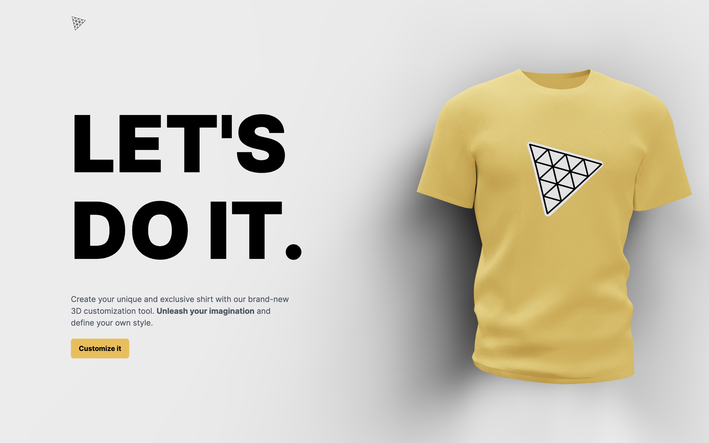
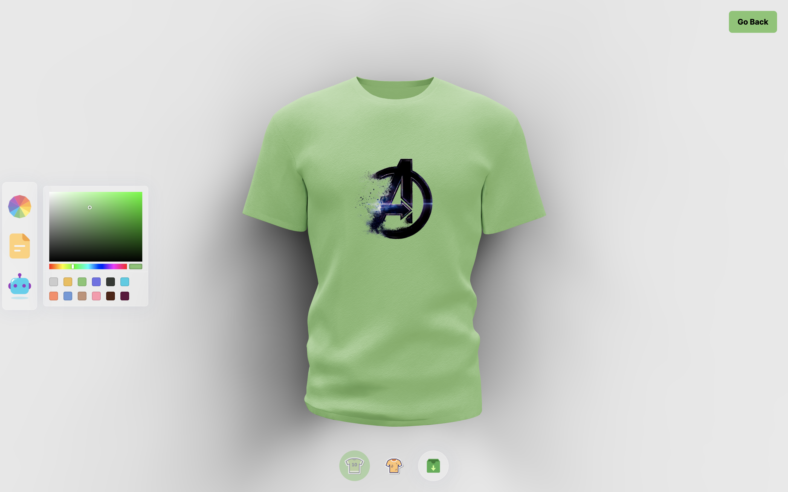
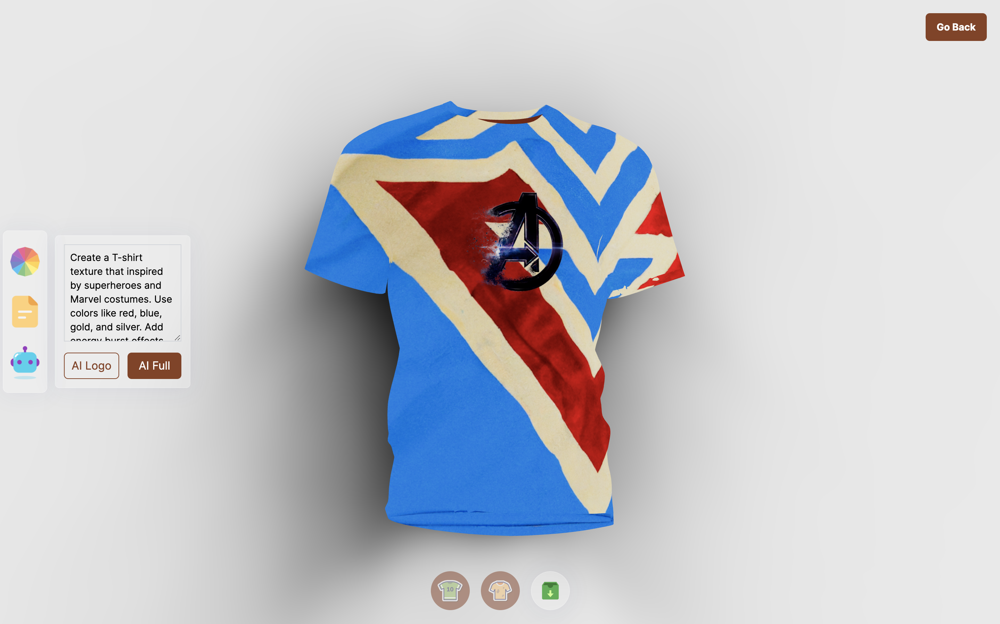

# 3D T-Shirt Customizer

## Table of contents

- [Introduction](#introduction)
- [Demo](#demo)
- [Technology](#technology)
- [Features](#features)
- [Run](#run)

## Introduction

The 3D T-Shirt Customizer is a groundbreaking web application that empowers users to design personalized t-shirts like never before. Utilizing cutting-edge technologies, including Three.js, React.js, Tailwind.css, Node.js, Express.js, and the impressive capabilities of OpenAI, this project revolutionizes the landscape of t-shirt customization. It delivers a user-friendly and immersive experience, seamlessly blending art and technology to provide an unparalleled platform for expressing individuality through wearable art.

Experience the magic of personalized t-shirt design by visiting the deployed project website: http://threejs-ai.infinityfreeapp.com/. Get ready to unleash your creativity, embrace the limitless design possibilities, and craft t-shirts that are a true reflection of your unique style and personality with unparalleled ease and innovation!

## Demo

## Technology

The main technologies used to build this application are:

- Three.js
- React.js
- Tailwind.css
- Node.js
- OpenAI
- Express.js

## Features

A 3D T-Shirt Customizer with following features:

- Customization Options: Users can effortlessly customize t-shirts to match their unique style and preferences. Change colors, apply logos, and add textures to create one-of-a-kind designs.

- AI-Generated Designs: The integrated OpenAI technology allows users to explore AI-generated logos and textures, providing an endless source of inspiration for creative designs.

- Real-Time 3D Preview: Our advanced Three.js-powered 3D preview feature enables users to visualize their designs in real-time, allowing for instant adjustments and ensuring the final product matches their vision.

- Download and Share: Once users are satisfied with their creations, they can easily download the custom-designed t-shirt and share their masterpieces with friends, family, or on social media platforms.

## Run

**Server**

- Open the project and navigate to server folder. Create ".env" file. Write OPENAI_API_KEY as variable name and put your own key as a value, previously generated in your OpenAI account.
- Make sure you are in the server folder and run in the console "npm install" to set up an existing npm package. Then run "npm run start" to start the server.

**Client**

- Navigate to the client folder and run "npm install" to set up an existing npm package. Then run "npm run dev" to start the clien. Follow the link given in the console.
- Enjoy the awesome 3D T-Shirt Customizer.